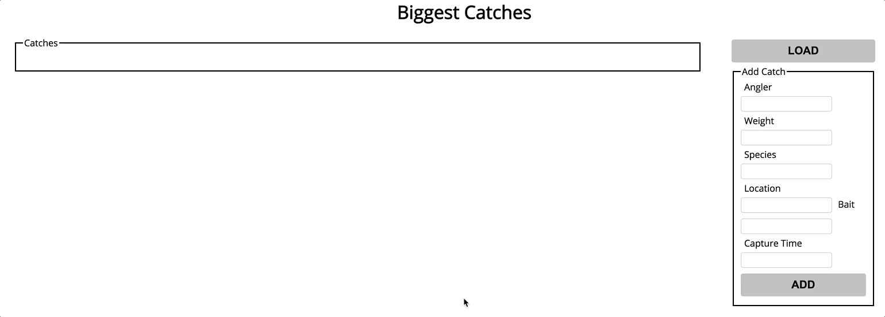
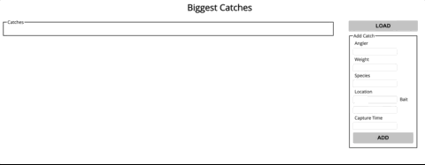
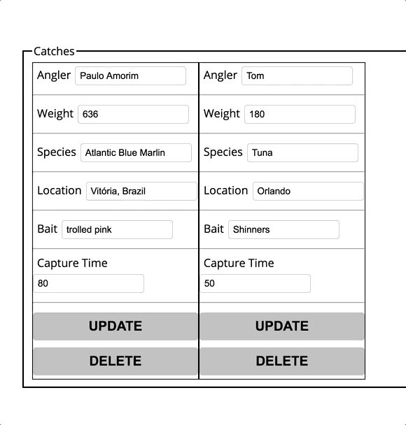

# fisher-recorder
Tasked with implementing functionality for CRUD operations on a biggest catch inputs form

## [Click Demo Here](https://rdrachenberg.github.io/fisher-recorder/) 
## Link - https://rdrachenberg.github.io/fisher-recorder/

## Load - Read

    

## Add - Create

    

## Edit - Update

    

## Delete

    

**Technologies Used**
* Javascript
* FireBase
* HTML 
* CSS 

## File structure:

        📦fisher-recorder
        ┣ 📂gifs
        ┃ ┣ 📜fisher.gif
        ┃ ┣ 📜fisher2.gif
        ┃ ┣ 📜fisher3.gif
        ┃ ┗ 📜fisher4.gif
        ┣ 📜README.md
        ┣ 📜app.js
        ┣ 📜index.html
        ┗ 📜styles.css